# Servicios de IT basados en ITIL

## Universidad Autónoma del Estado de México

**Facultad de Contaduría y Administración**

**Alumno:** Jesus Roberto Candelas Bernal  
**Profesora:** Angelica Diaz Garcia  
**Programa académico:** Lic. en Informática Administrativa

---

## Evidencias del proyecto

### Creación de cuentas

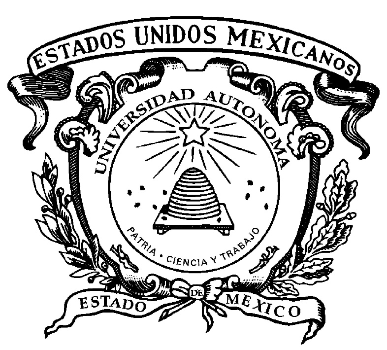

El primer día, creamos nuestras cuentas por medio de nuestro correo institucional. La primera cuenta fue la de Microsoft Azure.

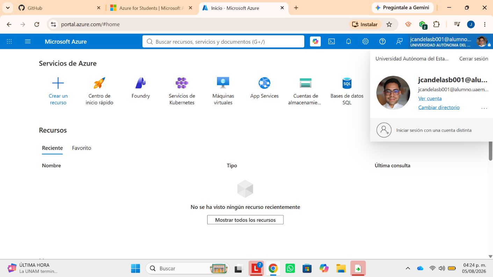

Después creamos la cuenta de Alassia.

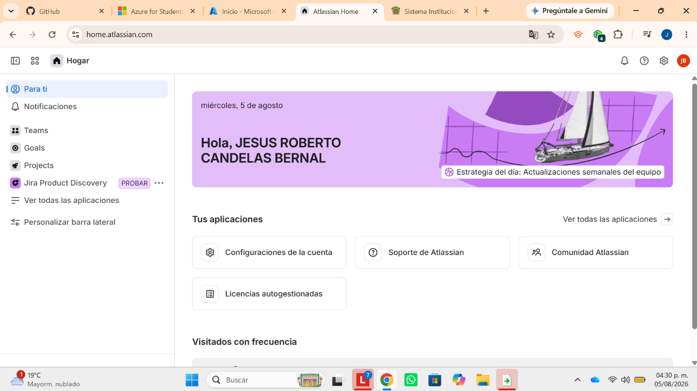

---

### Laboratorio de red en la nube

Creamos nuestro laboratorio de red en la nube.

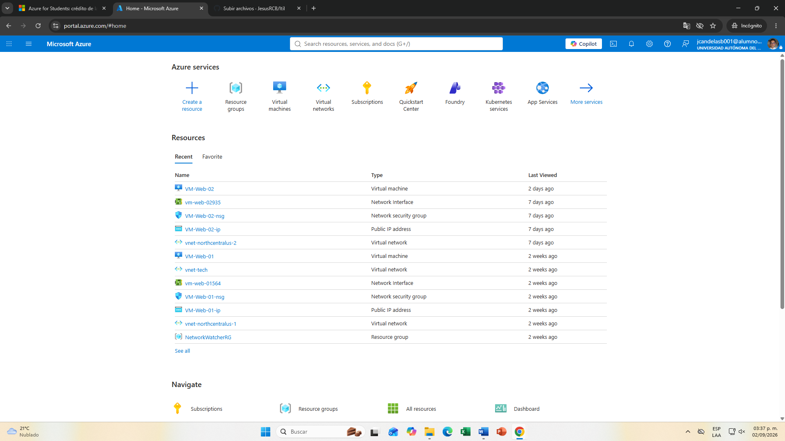

Creamos nuestros **Resource Groups**.

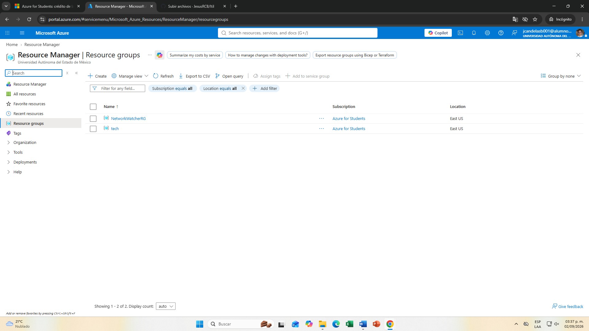

Dentro tenemos todas nuestras redes, discos y los elementos necesarios para nuestra red en la nube.

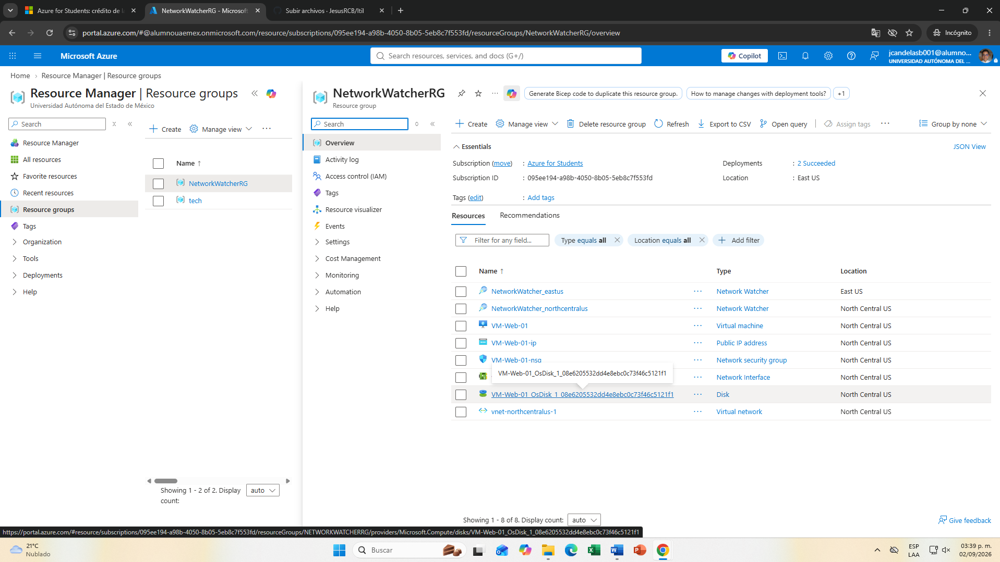

---

### Máquinas virtuales y servidor web

Creamos nuestra primera máquina virtual de prueba.

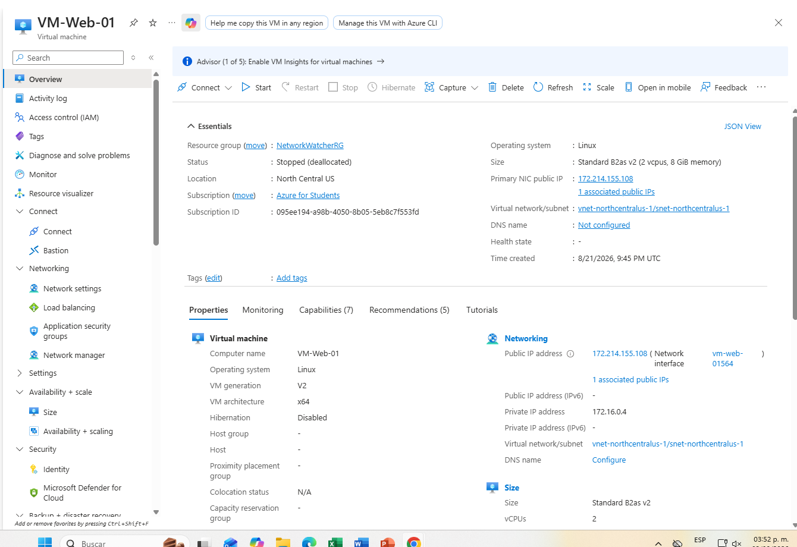

Creamos nuestra segunda máquina virtual con Ubuntu, con la que realizaremos nuestro primer servidor web.

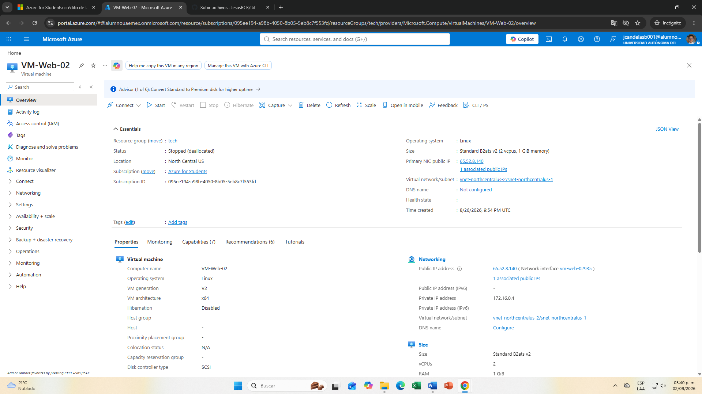

Configuramos el puerto 80 para que pudiéramos acceder, creamos la configuración de nuestra red vitual http y con el puerto 80.

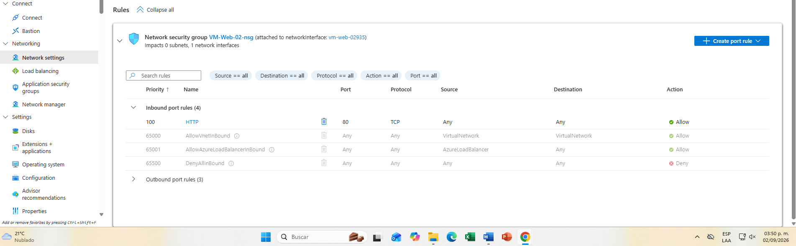

Después de crearla, entramos a la terminal e instalamos Apache.

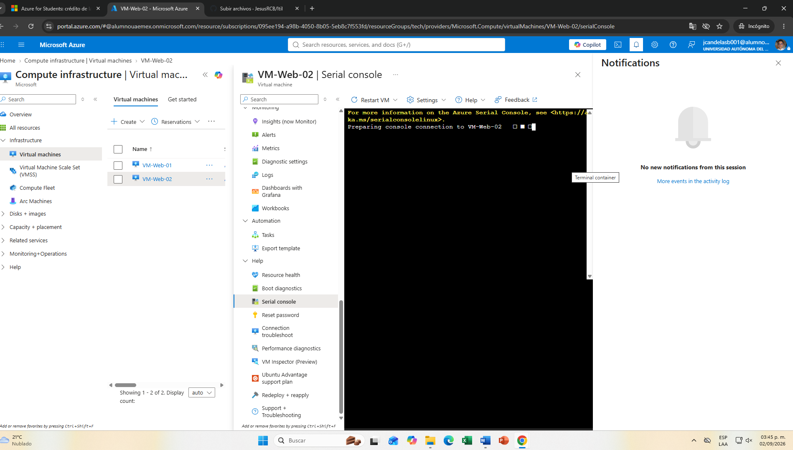

Vemos que ya está establecida la conexión.

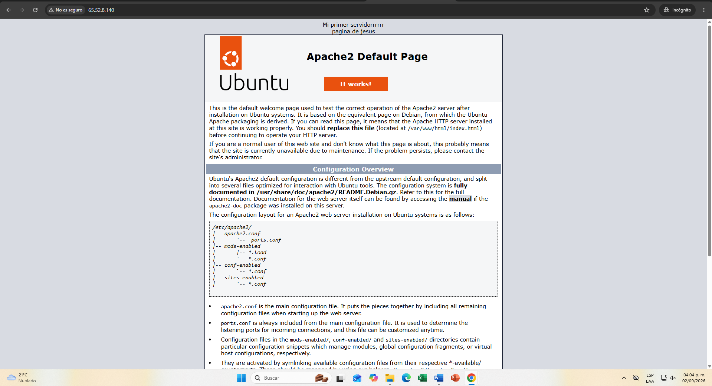
